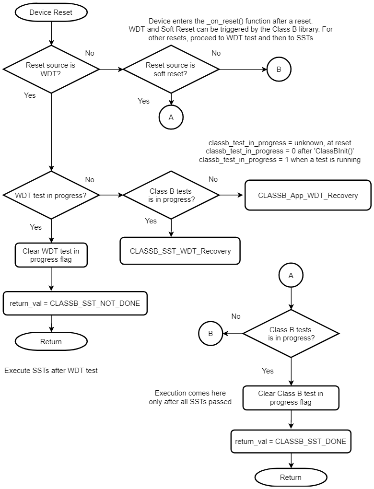
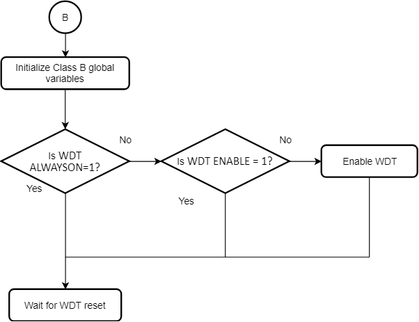

# Configuring the Library

This section provides details necessary to integrate the Class B library with other software components.

## Reserved SRAM area for the Class B library

It is required to reserve 1kB of SRAM for exclusive use by the Class B library.
When the Class B library is added into the project with the help of MHC, the linker setting is modified by MHC as shown below.
In this example, the ATSAME54P20A device with 256kB of SRAM is used.

`-DRAM_ORIGIN=0x20000400,-DRAM_LENGTH=0x3FC00`

## Modified Startup Sequence

When generating project with help of MPLAB Harmony 3, the startup code is present in a file named `startup_xc32`.
This file contains the `Reset_Handler` which has all startup code that runs before the `main()` function.
Initialization of the Class B library is done from the `_on_reset` function which is the first function
to be executed inside the `Reset_Handler`. The function named `CLASSB_Startup_Tests` executes all startup self-tests
inserted into `classb.c` file by the MHC. If none of the self-tests are failed, this function returns `CLASSB_STARTUP_TEST_PASSED`.
If any of the startup self-tests are failed, this function does not return.
The self-tests for SRAM, Clock and Interrupt are considered non-critical since it may be possible to execute
a fail-safe function after detecting a failure. In such case, the `CLASSB_SelfTest_FailSafe()` function is
called when a failure is detected. In the case of critical failures (CPU registers or internal flash),
the corresponding self-test remains in an infinite loop to avoid unsafe execution of code.

**Note**
1. The library defines the `_on_reset` function and handles some of the reset causes.
The application developer shall insert functions to handle the rest of the reset causes.

## WDT Test and Timeout

The Watchdog timer is used as a recovery mechanism in case of software failures.
The Class B library enables the WDT and checks whether a WDT reset is issued if the timer is not cleared.
In `CLASSB_Startup_Tests`, before performing startup self-tests, the WDT timeout period is configured.
This timing can be adjusted based on the number of self-tests run during startup.
If any of these self-tests takes more time than the WDT timeout period, it results in a WDT reset.
Thus, properly configuring the WDT period is essential during startup.
If all of the self-tests pass during startup, then the Class B library startup resets the device.
When execution reaches the main() function, the WDT configuration will be same as that in the fuses.
So the WDT should be configured via fuses, as needed by the application.
The WDT timeout should be larger than the time taken by any of the self-tests used during run-time.

## Configuring Startup Tests via MHC

Use MHCM to clone the `classb` repo. When an MPLAB Harmony 3 project is created, the MHC lists all available
components that can be added to the project. The self-tests which need to run during startup can be configured via MHC.
The `Configuration Options` menu appears with a mouse click on the `Class B Library` component inside
the `Project Graph`. The configurations done via MHC does not configure the library, instead it helps to modify
the input arguments and to decide whether to run a specific test during startup.

