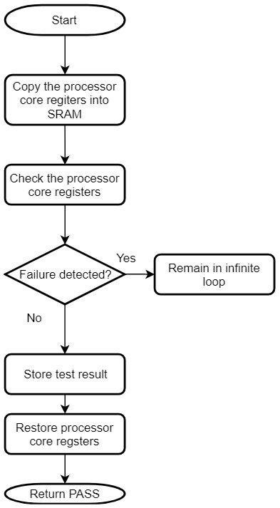

## Class B Peripheral Library Usage

This topic describes the basic architecture of the Class B library and provides information and examples on how to use it.
APIs defined by the Class B library can be used either by the start-up code or by the application code.
The application may use PLIBs, drivers or middleware from the Harmony 3 software framework along with the Class B library code.

**Interface Header File** : classb.h

The interface to the Class B Library is defined in the classb.h header file. Any C language source (.c) file
that uses the Class B should include classb.h.

## Library Header Files

1. classb_clock_test.h
2. classb_common.h
3. classb_cpu_reg_test.h
4. classb_flash_test.h
5. classb_interrupt_test.h
6. classb_io_pin_test.h
7. classb_sram_test.h

## Library Source Files

1. classb.c
2. classb_clock_test.c
3. classb_cpu_reg_test.S
4. classb_cpu_pc_test.c
5. classb_flash_test.c
6. classb_interrupt_test.c
7. classb_io_pin_test.c
8. classb_result_management.S
9. classb_sram_test.c

## Abstraction Model

The following picture shows positioning of Class B library in a Harmony 3 based application.

Figure - Class B library in MPLAB Harmony 3

## Start-up vs. Run-time

The Class B library contains many self-test routines those can be executed at startup and run-time.
If a self-test is executed at startup, it is called as a Start-up Self-test (SST) and if it is executed
at run-time, then it is called a Run-time Self-test (RST). There are a few self-test which can be used
only as an SST or as RST, such self-tests has &#39;SST&#39; or &#39;RST&#39; in the API name
eg: `CLASSB_RST_IOTest()`, `CLASSB_SST_InterruptTest()`. If a self-test API does not have &#39;SST&#39;
or &#39;RST&#39; in its name, then it can be used at startup as well as runtime.

### Start-up Self-test (SST)

SSTs are used to test a component inside the microcontroller before it is initialized and used.
When the Class B library is added via MHC, the selected SSTs are inserted into the `_on_reset()`
function which is called from the `Reset_Handler()`. This means that none of the data initialization
could have happened before running SSTs. So, the Class B library initializes necessary variables
before using them. It is not mandatory to test all the components during startup. The SRAM can be
tested partially if a faster startup is needed by the application. In this case, modify the
corresponding configuration macro (`CLASSB_SRAM_STARTUP_TEST_SIZE`) present in `classb.h` file
to change the size of the tested area.

### Run-time Self-test (RST)

RSTs can be used by the application during run-time to check safe operation of different components
in the microcontroller. These tests are non-destructive. In the case of run-time tests, the application
shall decide &#39;which&#39; test to execute &#39;when&#39;.

## Components in the Library

The Class B library contains self-test routines for different components inside the CPU.

Figure – Components in the Class B library

### Critical and Non-critical Components

Based on the impact of failure, different components inside this Class B library are categorized
as critical or non-critical.

If the self-test for CPU registers, PC or Flash detects a failure, the code execution is stopped,
and it remains in an infinite loop. This is to prevent unsafe code execution. In the case of non-critical
components, a failsafe function (`CLASSB_SelfTest_FailSafe`) is called when a failure is detected.
This function contains a software break point and an infinite loop. Further code shall be added into
this function as per the application need. The failsafe function must not return to the Class B library,
since it is called due to a self-test failure.
Avoid use of features which depend on the failed component. For example, if self-test for clock is failed,
it is not advisable to use UART for error reporting as BAUD rate may not be accurate. In the case of SRAM
failure, avoid the use of function calls or use of variables in SRAM. A simple error reporting mechanism
in this case of SRAM failure can be toggling of an IO pin.

#### Critical Components

1. CPU registers including the Program Counter
2. Internal Flash program memory

Generic Flow of Critical Tests

#### Non-critical Components

1. Internal SRAM
2. CPU clock
3. Interrupts
4. IO pins

Generic Flow of Non-Critical Tests

## Self-tests for Components in the Library

## CPU Registers

The ARM® Cortex®-M4F is the CPU on the SAM D5x/E5x devices. The Class B library checks the processor
core registers and FPU registers for &#39;stuck-at&#39; faults. The &#39;stuck at&#39; condition causes
register bit to remain at logic 0 or logic 1. Code execution should be stopped if this error condition
is detected in any of the CPU registers.

Testing FPU registers is optional as it is needed only if the FPU is used in the application.
This self-test follows the register save/restore convention specified by AAPCS.
It can be used at startup as well as run-time. The Program Counter (PC) self-test is designed
as a separate test since this register cannot be checked with usual test data patterns.

Flow chart of the self-test for CPU registers

## Program Counter (PC)

The self-test for PC checks whether a &#39;stuck-at&#39; condition is present in the PC register.
The &#39;stuck at&#39; condition causes register bit to remain at logic 0 or logic 1.
Code execution should be stopped if this error condition is detected.

The self-test for PC calls multiple functions in predefined order and verifies that each function
is executed and returns the expected value. If the return values of all test functions are correct,
the Program Counter is assumed to be working fine. This self-test can be used at startup as well as run-time.

Flow chart of the self-test for Program Counter (PC)

## Flash

The internal flash memory of the device needs to be checked for proper functionality.
The self-test for internal flash performs CRC check on the internal flash memory of the device.
The address range is configurable for this self-test. It runs CRC-32 algorithm with the polynomial 0xEDB88320
and compares the generated checksum with the expected checksum. It uses table-based approach where the table
is generated during the execution.

This self-test uses a CRC-32 generation function. This function is used inside the Class B library to generate
CRC-32 of the internal Flash memory but it can be used on any contiguous memory area.
The flash self-test can be used at startup as well as run-time. If this self-test is used during start up,
it must be ensured that the CRC of the application area is precalculated and stored at a specific memory
address which is passed as an argument for the Flash self-test. If this self-test detects a failure,
it remains in an infinite loop.

Flow chart of the self-test for internal flash program memory

## SRAM

Self-test for the SRAM element looks for stuck-at faults, DC faults and addressing faults with the help
of RAM March algorithms. One of the input arguments to this self-test selects the algorithm. This self-test
copies the data from the tested area of the SRAM into the reserved area in the SRAM and restore the data
after the test. Refer to section &#39;Configuring the Library&#39; for the details on reserving the SRAM.
The stack pointer is moved to the reserved area in the SRAM before running this self-test.
The SRAM self-test can be used at startup as well as run-time.

It provides three standard tests to detect error conditions,

1. March C
2. March C minus
3. March B

Flow chart of the self-test for SRAM

Flow chart of the internal routine for SRAM self-test

## Clock

The self-test for CPU clock checks whether the CPU clock frequency is within the permissible limit.
It uses RTC and SysTick to measure the CPU clock frequency. The RTC is clocked at 32768 Hz from the XOSC32K
and CPU clock can be from any other high frequency oscillator. If the CPU clock frequency is within specified
error limit, it returns PASS. The test duration is defined by one of the input arguments.
The RTC is configured to take clock from an external 32.768 kHz accurate crystal. The clock self-test can be
used at startup as well as run-time.

Flow chart of the self-test for CPU clock frequency

## Interrupt

The self-test for this element checks the interrupts functionality of the microcontroller. It configures the
Nested Vectored Interrupt Controller (NVIC), the RTC peripheral and the TC0 peripheral to test the interrupt
handling mechanism. It verifies that at-least one interrupt is generated and handled properly.
This self-test also checks whether the number of interrupts generated are too many within a given time period.
It reports a PASS if the RTC has generated at-least one interrupt and the total number of interrupts generated
by the TC0 is greater than one and less than the specified upper limit. The clock used for RTC is 1kHz from the
internal OSCULP32K and for TC0 the clock is same as the default CPU clock (48MHz from the DFLL48M).
The interrupt self-test can be used only at startup.

Flow chart of the self-test for interrupts

## IO pin

The self-test for IO pins verifies that a given output pin is able to keep the given logic level on the pin
and a given input pin is able to read the logic state present on the pin.

As the exact use of an IO pin is decide by the application, it is the responsibility of the application to
configure the IO pin direction and drive the pin to the expected state before calling this self-test.
Before testing an output pin, call `CLASSB_IO_InputSamplingEnable()` function to enable input sampling for the IO pin.
When testing an input pin, ensure that the IO pin is externally kept at a defined logic state.
The IO pin self-test can be used at only at run-time.

Flow chart of the self-test for IO pins

